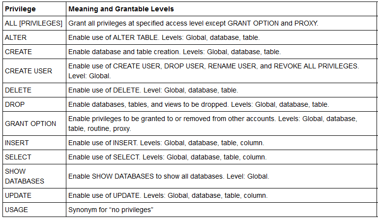

# DB Assignment 4 (Databases & MySQL)
Made by Viktor Kim Christiansen & Chris Rosendorf
# Overview
School assignment with focus on privileges and logging.
1. Run the DB with Docker `docker run --rm --name my_mysql -p 3306:3306 -e MYSQL_ROOT_PASSWORD=tropaadet -d mysql:latest`
2. Add the mysqlsampledatabase.sql
3. Execute the query `SET global general_log = 1; SET global log_output = 'table'`
4. Run the queries in exc1 & exc2

# Exercise 1 - User privileges
Listing rights for every user
## Reference Permission Table


## Inventory:
`Is used to maintain the two tables products and productlines`
* SELECT, DELETE, UPDATE, INSERT on products & productlines tables
```
CREATE USER 'inventory' IDENTIFIED BY 'faker85';
GRANT SELECT, DELETE, UPDATE, INSERT on classicmodels.products TO inventory;
GRANT SELECT, DELETE, UPDATE, INSERT on classicmodels.productlines TO inventory;
```

## Bookkeeping:
`Make sure that all orders are payed`
* SELECT on orders, orderdetails, payments
```
CREATE USER 'bookkeeping' IDENTIFIED BY 'faker85';
GRANT SELECT on classicmodels.orders TO bookkeeping;
GRANT SELECT on classicmodels.orderdetails TO bookkeeping;
GRANT SELECT on classicmodels.payments TO bookkeeping;
```

## Human Resources:
`Takes care of employees and their offices`
* SELECT, DELETE, UPDATE and INSERT on employees & offices
```
CREATE USER 'humanres' IDENTIFIED BY 'faker85';
GRANT SELECT, DELETE, UPDATE, INSERT on classicmodels.employees TO humanres;
GRANT SELECT, DELETE, UPDATE, INSERT on classicmodels.offices TO humanres;
```

## Sales:
`Creates the orders for the customers`
* SELECT on customers and SELECT, DELETE, UPDATE and INSERT on orders & orderdetails 
```
CREATE USER 'sales' IDENTIFIED BY 'faker85';
GRANT SELECT on classicmodels.customers TO sales;
GRANT SELECT, DELETE, UPDATE, INSERT on classicmodels.orders TO sales;
GRANT SELECT, DELETE, UPDATE, INSERT on classicmodels.orderdetails TO sales;
```

## IT:
`Maintains this database`
* All rights on everything
```
CREATE USER itadmin IDENTIFIED BY 'faker86';
GRANT ALL PRIVILEGES ON *.* TO itadmin;
```

## Arguments for the limitations
* We tried to specificy the different tables each user minimally requires to do their job correctly, and the only tricky one is Sales, since you can argue for what sale actually need rights to. We felt like they needed to do almost everything on orders, and then let another department take care of user registration.
The IT guy gets to do whatever he wants.

* Passwords could be better, or even not have passwords, only use SSH keys and a SQL proxy in a container running in the same pod (in kubernetes) as the application with the specific user.


# Exercise 2 - Logging
First we ofcourse set up logging earlier
Logging gets saved to mysql.general_log, see it with the following query: `select CONVERT(argument USING utf8 ) from mysql.general_log;`
Check the log (log.csv) in the repo.

The following log entry did not get allowed, but we can't see the error message anywhere (if you know how to see that please say so!)(Second last line in log.csv)
`INSERT INTO classicmodels.employees (employeeNumber, lastName, firstName, extension, email, officeCode, reportsTo, jobTitle) VALUES (8585, 'Bingomanden', 'William', 'x8585', 'william@bingo.dk', 1, 1143, 'Bingo Chef')
select CONVERT(argument USING utf8 ) from mysql.general_log`

### Insert 2 new employees
```
INSERT INTO classicmodels.employees 
(employeeNumber, lastName, firstName, extension, email, officeCode, reportsTo, jobTitle)
VALUES 
(8585, 'Bingomanden', 'William', 'x8585', 'william@bingo.dk', 1, 1143, 'Bingo Chef'); 

INSERT INTO classicmodels.employees 
(employeeNumber, lastName, firstName, extension, email, officeCode, reportsTo, jobTitle)
VALUES 
(8586, 'Bingomanden', 'William2', 'x8585', 'william2@bingo.dk', 1, 1143, 'Bingo Chef2');
```

### Insert 1 new product
```
INSERT INTO classicmodels.products 
(productCode, productName, productLine, productScale, productVendor, productDescription, quantityInStock, buyPrice, MSRP)
VALUES 
('S85_8585', 'Bingobilen', 'Classic Cars', '8:5', 'Roskilde Pigerne', 'Hurtig, nem, dyr', 8585, 85.85, 85.86);

```

### Insert 1 new order
```
INSERT INTO classicmodels.orders 
(orderNumber, orderDate, requiredDate, shippedDate, status, comments, customerNumber)
VALUES 
(85858585, NOW(), NOW(), NOW(), 'Shipped', 'Den er go', 496);

INSERT INTO classicmodels.orderdetails 
(orderNumber, productCode, quantityOrdered, priceEach, orderLineNumber)
VALUES 
(85858585, 'S85_8585', 2, 85.85, 8);
```

# Exercise 3 - Backup and recovery

Dumping a SQL file from inside a Docker container, we just re-attach to the running container and run the following:


`docker exec -i my_mysql mysqldump -u root --password=tropaadet classicmodels > fulldump.sql`
